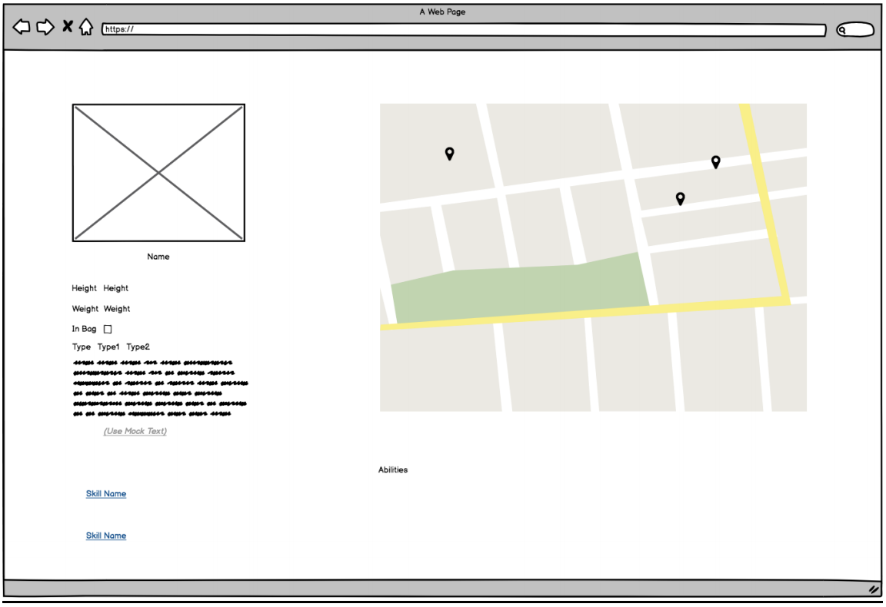

##Pokémon Craft Demo

###Description:

The purpose of this document is to serve as your guide in building out the Pokedex of San Diego. Follow
the requirements, guidelines, and designs as you get to showcase your abilities in building a web
application.

###Technological Requirements:

1. Create a mobile first application that works in every any modern browser (Chrome, Safari,
Firefox, Edge).
2. Use the attached wireframes when creating the layout of the application.
a. Feel free to make changes if you see fit (Be ready to discuss the changes you might have
made).
b. Use any color palette when designing the application (black and white is welcome).
c. Use any font (type, color, weight).
3. Technology – The goal of this Demo is to showcase your ability as a developer to rapidly develop
a modern web application. We also want you to be able to show off your coding skills. So, when
choosing a technological stack keep the following items in mind:
a. ReactJS is preferred
b. The use of a CSS preprocessor (SCSS or SASS) or styled-components is preferred.
c. For the actual UI components, please try to make sure you use your own.
d. Feel free to use any other library that you see fit (redux, relay, etc.), but be prepared to
discuss the use of these libraries.
e. Use a build system (webpack preferred), and feel free to make any optimization, use any
plugin that you see fit. (Be prepared to discuss the use of these libraries).
f. Incorporate a Unit test with at least 2 files and show why you tested them and how you
tested them.
4. Think Performance. Show off any performance enhancements you have that can make this
application load as fast possible, and as little as possible.

###Data sources:

Use the following rest APIs when creating the application.
• https://pokeapi.co/
o Use the v2 API when getting information regarding the list of Pokémon, their
abilities, their names, their type, image sprites, etc.
o The API is subject to 100 requests per IP address per minute, so please make
sure you can cache as much as you can as possible.
o Refer to the documentation, for more information.
• https://api.craft-demo.net/pokemon
o Use this API to get the Pokémon’s location within San Diego.
o The API accepts Pokémon id (aka numeric order), as the requestId
§ Example: https://api.craft-demo.net/pokemon/1
§ Returns an array of coordinates that a Pokémon maybe located in within
San Diego (latitude/longitude).
o Use this in the request header:
§ x-api-key - nDl52TEWfY1WUqvkeEMiI71wcLHDWwOl9uene9Nh

##Features & Designs:

###Required Features:

• The application should be mobile responsive (see designs below)
• Although The application has no concept of authentication, the application should allow the
User to “save” Pokémon that they have caught, and it should persist within the browser. Please
use any in-browser persistent storage mechanism that you think is appropriate.
• The application will show more details of each Pokémon when selected by a user (as shown in
the designs below)
• The application will plot the location of each Pokémon on a map based on the results of the
APIS detailed above (data sources section of this document).

###Main Page:

• This page will show the list of all 151 original Pokémon.
o Each item will show their image, and the name of the Pokémon.
§ The image URL can be found in the API.
• There will be a switch button at the top, which either shows all 151, Pokémon, or filters
the Pokémon based on the users “saved” Pokémon.
§ Saved Pokémon persist in a user’s browser. (There is no concept of
authentication in this application).
• The user will also be able to use the search box to search a Pokémon by name. (There is
no API for this)
• When clicking on a Pokémon it will take you to the Pokémon Detail Page (see designs
below in the Pokémon Detail Page section).

##Main Page (continued):

##Main Page Mobile Layout:

##Main Page Mobile Layout (continued):

###Pokémon Detail Page:

• This Page will show more detail about the selected Pokémon
o Show information about the Pokémon’s Height, weight, type (all found in the
API)
o Show information about the Pokémon’s description (use mock text)
• Show the Pokémon’s image (found in API)
• Allows the User to toggle the setting whether or not the Pokémon is in their bag (aka
Saved Pokémon).
• List out the abilities of the Pokémon (basic name of the abilities will do).
• Using Google Maps display the location of the selected Pokémon.

##Pokémon Detail Page Mobile:

• This page shows the same data as the Desktop designs, except each data is divided into
3 sections
o Info – Show Information about the Pokémon.
o Location – Show the location of the Pokémon on a map.
o Abilities – List out the abilities of the Pokémon.

##Pokémon Detail Page Mobile (continued):

##Pokémon Detail Page Mobile (continued):

##Final Output:

• Hosting the site is optional, at the minimum, please have your site ready to run on your
local machine.
• Upload your work to a private Github repo and upload a ReadMe.file
o In your readme, make sure you outline the following:
§ The technologies you used
§ Your Idea Pipeline (How does this code make it to production)
§ A high-level design walkthrough (a paragraph will do)
• Talk about how your system works
• Talk about how your system communicates with other systems
• Talk about any special mechanism/feature that you might have
set up for the application.
§ Highlight/Talk about any design changes you made.
§ Instructions on how to run the example locally, or how to access the
hosted version.
• Have a zip version of the repo ready.